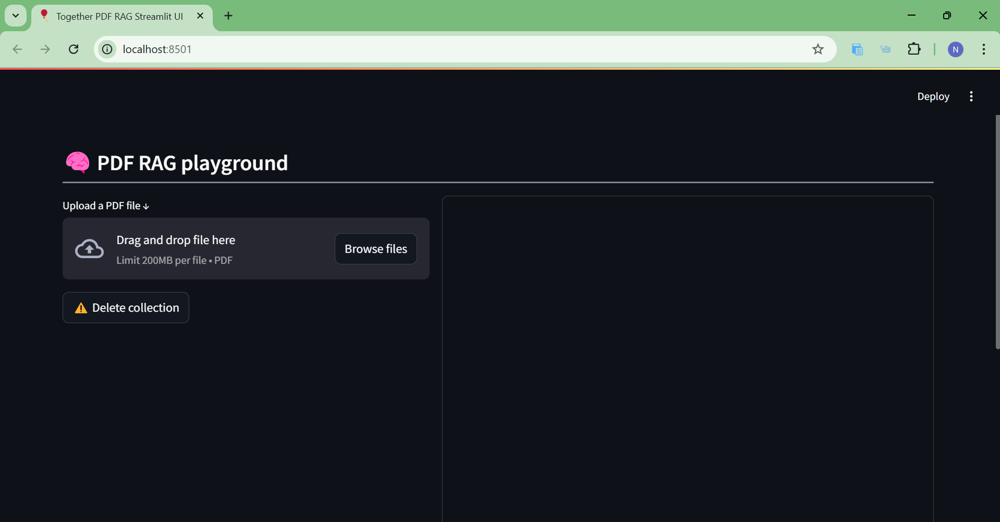
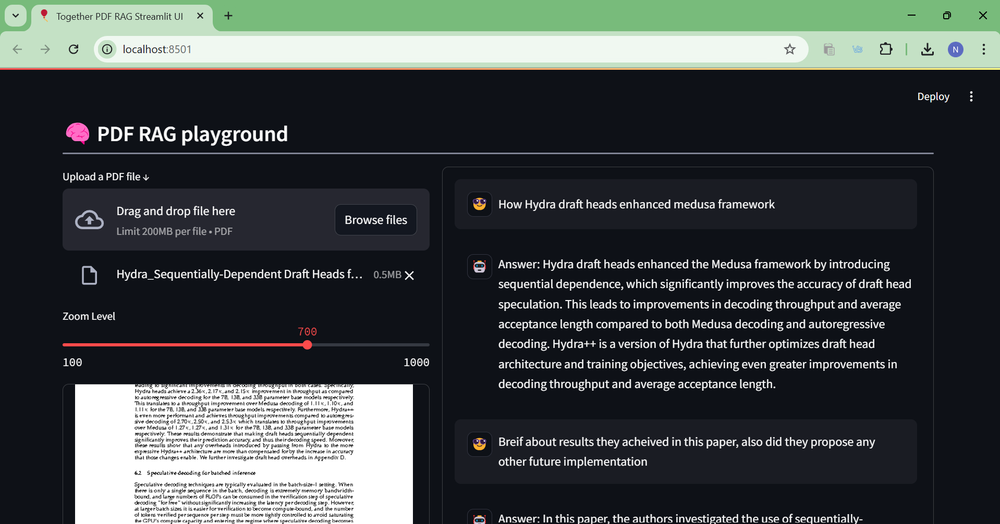
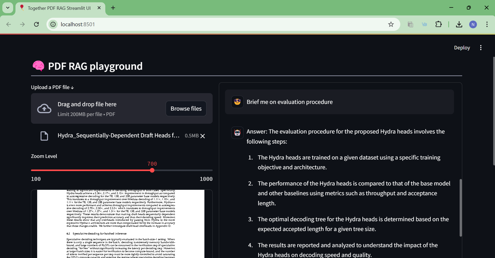
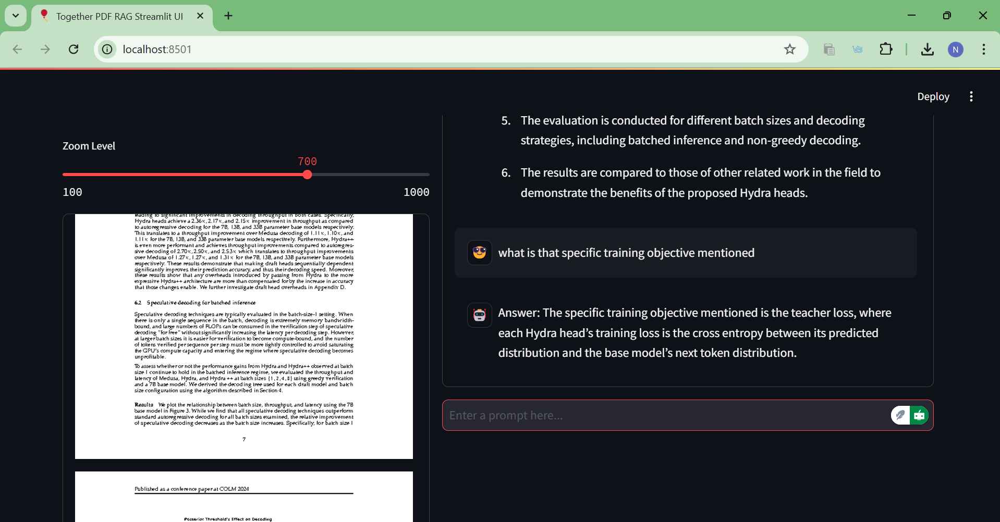

# 🤖 Chat with PDF locally using Together + LangChain

A powerful local RAG (Retrieval Augmented Generation) application that lets you chat with your PDF documents using Together API and LangChain. 

## ✨ Features

- 📄 PDF processing with intelligent chunking
- 🧠 Multi-query retrieval for better context understanding
- 🎯 Advanced RAG implementation using LangChain
- 🖥️ Clean Streamlit interface


## 🚀 Getting Started

### Prerequisites
1. **Clone Repository**
   ```bash
   git clone https://github.com/nityaraji/Chat-with-PDF.git
   cd Chat-with-PDF
   ```

3. **Set Up Environment**
   ```bash
   python -m venv venv
   source venv/bin/activate  # On Windows: .\venv\Scripts\activate
   pip install -r requirements.txt
   ```

### 🎮 Running the Application

#### Option 1: Streamlit Interface
```bash
streamlit run streamlit_app.py
```
Then open your browser to `http://localhost:8501`







## 💡 Usage Tips

1. **Upload PDF**: Use the file uploader in the Streamlit interface or try the sample PDF
2. **Ask Questions**: Start chatting with your PDF through the chat interface
3. **Adjust Display**: Use the zoom slider to adjust PDF visibility
4. **Clean Up**: Use the "Delete Collection" button when switching documents
